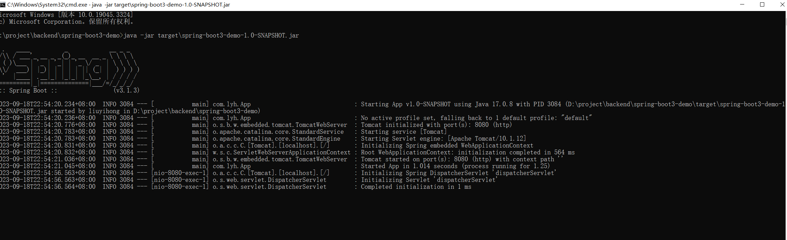

# 快速入门（SpringBoot 3.1.3）

## 一、前提
### 1.1、SprintBoot 使用版本
+ [SpringBoot 3.1.3](https://docs.spring.io/spring-boot/docs/3.1.3/reference/htmlsingle/)

### 1.2、软件环境
+ [Java 17](https://www.oracle.com/java/technologies/downloads/#jdk17-windows)
+ [Spring Framework 6.0.11](https://docs.spring.io/spring-framework/reference/index.html)
+ [Maven 3.6.3](https://maven.apache.org/download.cgi)
+ [SprintBoot3.1.3 Maven Plugin](https://docs.spring.io/spring-boot/docs/3.1.3/maven-plugin/reference/htmlsingle/)

### 1.3、学习链接（尚硅谷 - 雷丰阳）
+ [文档](https://www.yuque.com/leifengyang/springboot3)
+ [代码](https://gitee.com/leifengyang/spring-boot-3)
+ [视频](https://www.bilibili.com/video/BV1Es4y1q7Bf/)

## 二、SprintBoot 入门
### 1.1、是什么？
+ SpringBoot 可以简单、快捷的创建一个 独立的、生产级别的 Spring 应用。
    + 底层是 Spring。通过简单的配置可以快速使用 Spring 以及 第三方技术。

### 1.2、有啥用？
+ 简化开发
    + 快速创建 Spring 应用程序
+ 简化整合
    + 提供各种 starter、简化应用整合。
+ 简化配置
    + 按需自动加载 Spring 以及 第三方库，有默认配置（可修改）。
+ 简化部署
    + 内嵌 tomcat、jetty 等 servlet 容器，可以直接运行 jar 包。
+ 简化监控、运维
    + 提供 监控指标、健康检查、外部化配置 等生产级别的特性。

### 1.3、怎么用？ （举例：构建一个 HelloWorld 的 web 应用程序）
+ 构建一个 maven 项目
```text
// 使用旧模板（1.0）
mvn archetype:generate -DgroupId=com.lyh -DartifactId=spring-boot3-demo -DarchetypeArtifactId=maven-archetype-quickstart -DinteractiveMode=false
// 使用新模板（1.4）
mvn archetype:generate -DgroupId=com.lyh -DartifactId=spring-boot3-demo -DarchetypeArtifactId=maven-archetype-quickstart -DarchetypeVersion=RELEASE -DinteractiveMode=false
```

+ 修改 pom.xml，添加 parent
    + 所有 SpringBoot 项目都必须继承自 spring-boot-starter-parent
```text
<parent>
    <groupId>org.springframework.boot</groupId>
    <artifactId>spring-boot-starter-parent</artifactId>
    <version>3.1.3</version>
</parent>
```

+ 修改 pom.xml，引入 web starter
    + SprintBoot 支持各种 starter，使用 starter 可以快速引入、配置相关依赖
```text
<dependencies>
    <dependency>
        <groupId>org.springframework.boot</groupId>
        <artifactId>spring-boot-starter-web</artifactId>
    </dependency>
</dependencies>
```

+ 修改主程序类（main 入口）
    + spring-boot3-demo\src\main\java\com\lyh\App.java
    + 类名上追加 @SpringBootApplication 注解
    + main 方法内部调用 SpringApplication.run(App.class, args);
```java
package com.lyh;

import org.springframework.boot.SpringApplication;
import org.springframework.boot.autoconfigure.SpringBootApplication;

@SpringBootApplication
public class App {
  public static void main(String[] args) {
    SpringApplication.run(App.class, args);
  }
}
```

+ 追加业务类
    + spring-boot3-demo\src\main\java\com\lyh\controller\HelloWorldController.java
```java
package com.lyh.controller;

import org.springframework.web.bind.annotation.GetMapping;
import org.springframework.web.bind.annotation.RestController;

@RestController
public class HelloWorldController {
  @GetMapping("/hello")
  public String hello(){
    return "HelloWorld";
  }
}
```

+ 运行 SprintBoot 的方式
    + 通过 maven 运行 SprintBoot （mvn spring-boot:run）
    + 通过 maven 编译成 jar 包后，再运行 jar 包  （此处采用此方式）

+ 修改 pom.xml，引入 [maven plugin](https://docs.spring.io/spring-boot/docs/3.1.3/maven-plugin/reference/htmlsingle/) 
```text
<build>
  <plugins>
    <plugin>
      <groupId>org.springframework.boot</groupId>
      <artifactId>spring-boot-maven-plugin</artifactId>
    </plugin>
  </plugins>
</build>
```

+ 完整 pom.xml
    + 确认 pom.xml 中 packaging 为 jar
```xml
<project xmlns="http://maven.apache.org/POM/4.0.0" xmlns:xsi="http://www.w3.org/2001/XMLSchema-instance"
         xsi:schemaLocation="http://maven.apache.org/POM/4.0.0 http://maven.apache.org/maven-v4_0_0.xsd">
  <modelVersion>4.0.0</modelVersion>

  <parent>
    <groupId>org.springframework.boot</groupId>
    <artifactId>spring-boot-starter-parent</artifactId>
    <version>3.1.3</version>
  </parent>

  <groupId>com.lyh</groupId>
  <artifactId>spring-boot3-demo</artifactId>
  <packaging>jar</packaging>
  <version>1.0-SNAPSHOT</version>
  <name>spring-boot3-demo</name>
  <url>http://maven.apache.org</url>

  <dependencies>
    <dependency>
      <groupId>org.springframework.boot</groupId>
      <artifactId>spring-boot-starter-web</artifactId>
    </dependency>

    <dependency>
      <groupId>junit</groupId>
      <artifactId>junit</artifactId>
      <version>3.8.1</version>
      <scope>test</scope>
    </dependency>
  </dependencies>

  <build>
    <plugins>
      <plugin>
        <groupId>org.springframework.boot</groupId>
        <artifactId>spring-boot-maven-plugin</artifactId>
      </plugin>
    </plugins>
  </build>
</project>
```

+ 使用 maven 编译为 jar 包 
```text
mvn clean install
```

+ 执行 jar 包，默认启动端口号为 8080 的服务 
    + spring-boot3-demo\target\spring-boot3-demo-1.0-SNAPSHOT.jar
```text
java -jar target\spring-boot3-demo-1.0-SNAPSHOT.jar
```


+ 访问 http://localhost:8080/hello 输出 HelloWorld，即 web 应用构建成功


### 1.4、分析
+ 简化开发。
    + 无需编写 SSM 所需的 xml 配置文件，直接开发业务。

+ 简化整合
    + 引入 web starter，直接整合了 SSM 服务。 
    + [SprintBoot 官方提供的 starter](https://docs.spring.io/spring-boot/docs/current/reference/html/using.html#using.build-systems.starters)
```text
官方提供的 starter 命名格式为:
    spring-boot-starter-*
    
第三方提供的或者自定义的 starter 命名格式为:
    *-spring-boot-starter
```

+ 简化配置
    + 引入 starter 后，有默认配置，可直接使用。
    + 若要修正配置，可以在 src\main\resources 目录下通过 application.properties 或者 application.yml 文件修正。
    + [SprintBoot 官方提供的 starter 配置](https://docs.spring.io/spring-boot/docs/current/reference/html/application-properties.html#appendix.application-properties)

+ 简化部署
    + maven 编译成 jar 包后可直接运行，无需编译成 war 包再放到 tomcat 的 webapps 中。

+ 简化监控、运维
    + 提供 监控指标、健康检查、外部化配置（可在外部指定 application.properties 或者 application.yml 用于覆盖 jar 包中的配置）。

### 1.5、初始化 SpringBoot 项目的方式
+ [maven 命令行](./#13-helloworld-web)
+ [Spring Initializr](https://start.spring.io/)
+ IDE 工具（Eclipse、IDEA 等）,此处省略


