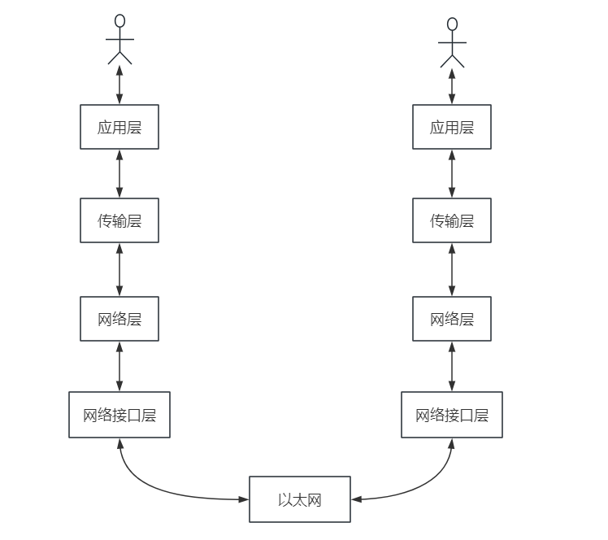

# TCP/IP

## 一、常见通信协议
+ 网络模型中，层 与 层之间需要使用 专用的协议 进行通信。
```text
应用层：
    DNS、DHCP、TFTP、FTP、SSH、POP、SMTP、HTTP

传输层：
    TCP、UDP

网络层：
    IP、ICMP、ARP

数据链路层：
    SLIP、CSLIP、PPP、MTU
```

### 1、网络层协议简单说明
+ 常见协议
```text
IP（Internet Protocol，网际协议 / 互联网协议）
    功能： 
        在 源地址 和 目的地址 之间传输数据。

    主要内容：
        IP 协议定义了 IP 地址，寻址方法，以及路由规则（通过 IP 地址标识网络设备，根据 IP 找到网络设备，通过路由跳转到网络设备）。
        IP 协议只是尽最大努力来传输数据包，并不保证所有的包都可以传输到目的地，也不保证数据包的顺序和唯一。

ICMP（Internet Control Message Protocol，网络控制消息协议）
    功能：
        在 IP 网络中发送控制消息，提供通信过程中的各种问题反馈。

    主要内容：
        ICMP 直接使用 IP 数据包传输，但 ICMP 并不被视为 IP 协议的子协议。
        常见的联网状态诊断工具依赖于 ICMP 协议。

ARP（Address Resolution Protocol，地址解析协议）
    功能：
        根据 IP 地址获取 网络设备的 物理地址（MAC 地址）。
    
    主要内容：
        根据 数据包中的 IPHeader 解析出 目标硬件地址（MAC 地址），从而实现通信。
```

#### 1.1、IP 协议简单说明
+ IP 协议分类
```text
广泛使用的 IP 协议为： 
    IPv4 
        使用 32 位 二进制数 作为地址，使用 "." 分隔 4 部分，每部分使用 8 位二进制数表示。
        可使用 点 分隔的 十进制 方式表示，比如 192.168.0.1。
    IPv6 
        使用 128 位 二进制数 作为地址。是为了解决 IPv4 地址耗尽和其它一些问题而研发的新版本的 IP。
        使用 冒号 分隔的 十六进制 来表示，并且可以省略其中一串连续的 0，比如 fe80::200:1ff:fe00:1。
```

+ IP 子网掩码说明
```text
使用 IP 地址给 设备编号，从而通过 IP 可以找到对应的网络设备。

IP 通过 网络号 与 主机号 来标注特定的 网络设备。
    网络号，负责标识 IP 地址 属于哪个 子网。
    主机号，负责标识 某个子网 下的 哪个 主机。

子网掩码(subnet mask) 又叫网络掩码、地址掩码、子网络遮罩，
    子网掩码不能单独存在，它必须结合IP地址一起使用。通过 子网掩码，可以计算出 IP 地址 的网络号和主机号。
    子网掩码由连续的 1 和连续的 0 构成，一共 32 位二进制数字。连续的 1 在前面，表示网络位；连续的 0 在后面，表示主机位。

举例：
    10.100.122.0/24
    
    其中 /24 表示的就是 子网掩码 （255.255.255.0）。
    255.255.255.0 二进制是「11111111-11111111-11111111-00000000」，在 0 之前是 24 个连续的 1，为了简化子网掩码的表示，用 /24 代替255.255.255.0。

IP 地址 与 子网掩码进行 按位与运算，可以得到 网络号。
IP 地址 与 按位取反后的子网掩码 进行 按位与运算，可以得到 网络号。

    以 10.100.122.2/24 为例，
        IP 地址为：10.100.122.2，转为二进制为： 00001010 01100100 01111010 00000010
        子网掩码为：255.255.255.0，转为二进制为：11111111 11111111 11111111 00000000
    按位与运算，二进制结果为： 00001010 01100100 01111010 00000000，即网络号为：10.100.100.0

        按位取反后的子网掩码： 00000000 00000000 00000000 11111111
    按位与运算，二进制结果为： 00000000 00000000 00000000 00000010，即主机号为：0.0.0.2
```

### 2、传输层协议简单说明
+ 常见协议
```text
TCP（Transmission Control Protocol，传输控制协议）
    主要内容：
        是一种面向 连接的，可靠的，基于 字节流 传输的通信协议。
        TCP 具有端口号的概念，用来标识同一个地址上的不同应用。
    
    连接
        建立连接（三次挥手）
        断开连接（四次挥手）

    数据传输可靠性
        超时重传
        流量控制
        滑动窗口
        拥塞控制

UDP（User Datagram Protocol，用户数据报协议）
    主要内容：
        是一种面向 无连接的，不可靠的，基于 数据报 传输的通信协议。
```

### 3、应用层协议简单说明
+ 常见协议
```text
DHCP（Dynamic Host Configration Protocol，动态主机配置协议）
    功能：
        用于局域网 自动分配 IP 地址 和 主机配置 的协议，可以使局域网的部署更加简单。

DNS（Domain Name System，域名系统）
    功能：
        将 "." 分隔的 域名 转换成不易记忆的 IP 地址。
        DNS 服务器间进行域传输的时候用 TCP 协议 以及 53 端口，客户端查询 DNS 服务器 时用 UDP 协议 以及 53 端口

FTP（File Transfer Protocol，文件传输协议）
    主要内容：
        进行文件传输的标准协议。
        基于 TCP，使用端口号 20 来传输数据，21 来传输控制信息。

TFTP（Trivial File Transfer Protocol，简单文件传输协议）
    主要内容：
        是一个简化的文件传输协议，其设计非常简单，通过少量存储器就能轻松实现，所以一般被用来通过网络传输小文件。

SSH（Secure Shell，安全外壳协议）
    主要内容：
        在不安全网络上用于 安全远程登录 和 其他安全网络服务 的协议
        基于 TCP，端口号 22
        
POP（Post Office Protocol，邮局协议）
    主要内容：
        是支持通过客户端访问电子邮件的服务，现在版本是 POP3，也有加密的版本 POP3S
        基于 TCP，端口号 110

SMTP（Simple Mail Transfer Protocol，简单邮件传输协议）
    主要内容：
        是互联网上发送电子邮件的事实标准
        基于 TCP，端口号 25

HTTP（Hyper Text Transfer Protocol，超文本传输协议）
    主要内容：
        是一个简单的 请求 - 响应协议，是 WEB 网络的基础，HTTPS 是 HTTP 的加密安全版本。
        基于 TCP，HTTP 默认使用端口 80，HTTPS 使用 443。
```

## 二、网络模型简单说明


+ 应用层
```text
为用户提供各种服务（HTTP、FTP、SSH、POP 等），不关心数据如何传输。

数据格式：
    HTTPHeader + MessageBody 
```

+ 传输层
```text
为应用层提供网络服务，即接收 应用层 A 的数据包，并传递给 应用层 B。
协议： 
    TCP、UDP

数据格式：
    TCPHeader + (HTTPHeader + MessageBody)
```

+ 网络层
```text
为传输层提供网络服务，进行实际的网络通信，将数据从 一个设备 传输到 另一个设备。
协议： 
    IP

数据格式：
    IPHeader + (TCPHeader + (HTTPHeader + MessageBody))
```

+ 网络接口层
```text
为网络层提供 数据传输 服务，将数据包在 以太网、WIFI 等网络上传输，通过 MAC 地址来定位 网络设备(MAC 地址具有唯一性)。

数据格式：
    MacHeader + (IPHeader + (TCPHeader + (HTTPHeader + MessageBody)))
```

### 2、TCP
```text
连接
    建立连接（三次挥手）
    断开连接（四次挥手）

数据传输可靠性
    超时重传
    流量控制
    滑动窗口
    拥塞控制
```