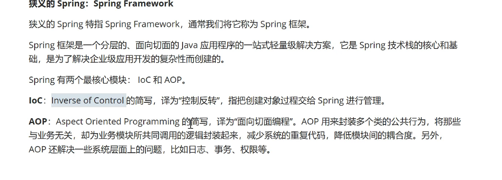
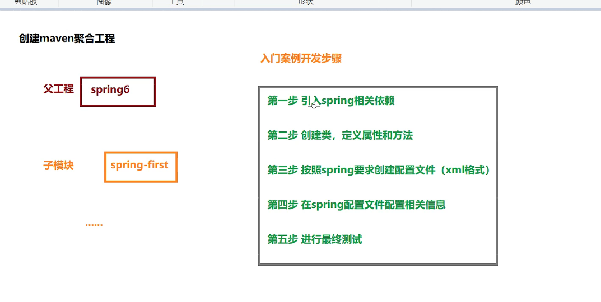

# 快速入门 (spring6.0)
+ [Spring 教程](https://spring.io/guides)

## 学什么
```text
spring 是一个开发框架，简化 企业级 Java 开发流程。
   包含多个模块： SpringFramework、SpringMVC、SpringBoot、SpringCloud 等
核心：
   IOC，控制反转
   AOP，面向切面编程
```


## springframework 


## helloworld



分析（反射创建对象）


Map<String, BeanDefinition> beanDefinitionMap


## log4j2

1、引入依赖
2、配置 log4j2.xml


## IOC


依赖注入

BeanFactory、ApplicationContext
