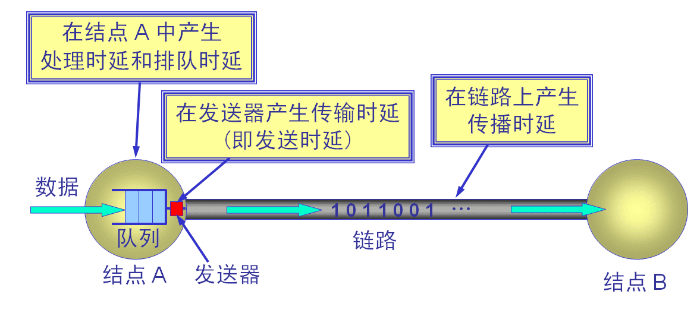
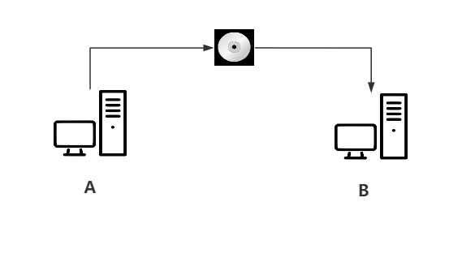
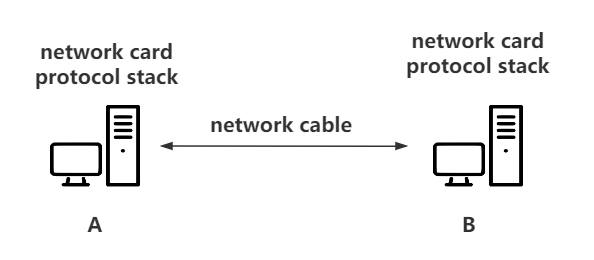
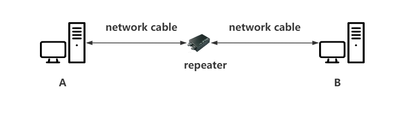
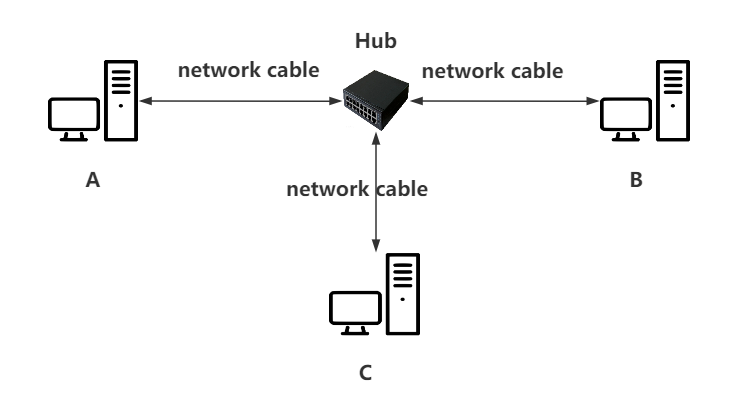
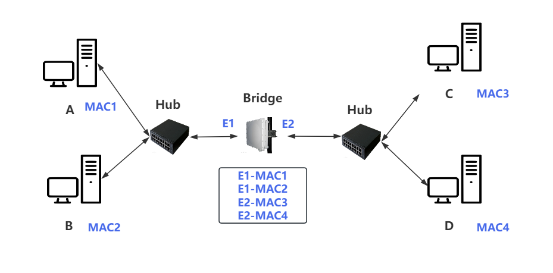
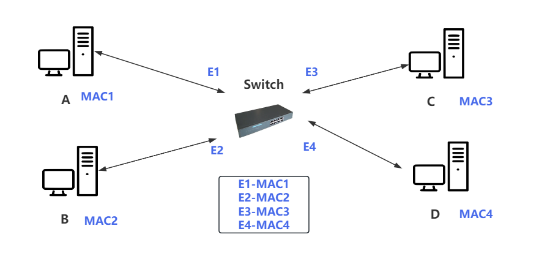
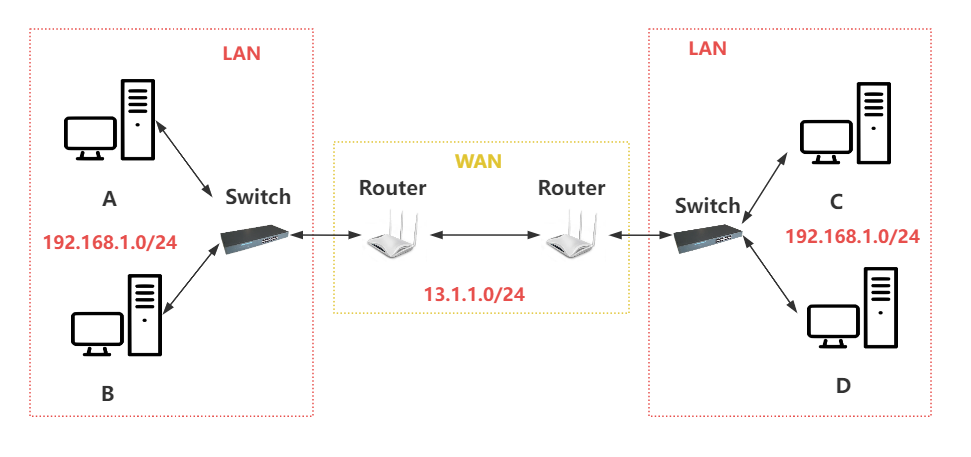
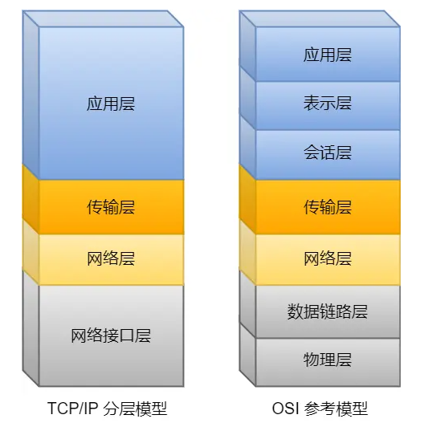

# 计算机网络

## 一、基本概念
### 1、计算机网络
#### 1.1、是什么(定义)
```text
计算机网络 
    指的是 由 通信线路 互相连接的 很多独立工作的计算机（结点） 组成的集合体。

因特网 / 互联网（Internet）
    指的是 由 通信线路 互相连接的 很多 计算机网络 组成的集合体。
```

#### 1.2、有啥用(功能)
```text
连通性
    通过 计算机网络（网线、路由器、交换机 等），使得 用户的 计算机 可以相互连接。

共享
    通过 计算机网络，实现 计算机 之间的资源共享（软件、硬件 共享等）、数据共享（音频、视频 共享等）。
```

#### 1.3、通信方式（C/S、P2P）
+ 计算机通信
```text
计算机通信
    指的是 主机 A 的 某个进程 和主机 B 的 某个进程 进行通信。

通信方式
    客户/服务器（Client/Server、C/S）
    对等方式（Peer-to-Peer、P2P）
```

+ 客户/服务器（Client/Server、C/S） 
```text
Client/Server 描述的是 计算机进程 之间 服务 与 被服务 的关系。
其中：
    Client 作为 服务的 请求方。
        Client 在 用户 调用后运行，主动的向 Server 发起请求（通信）。
        
    Server 作为 服务的 提供方。
        Server 启动后会不断运行，监听、处理 来自 Client 的请求。

特点：
    Client 一般不需要 特殊的硬件 或 复杂的操作系统，但需要知道 Server 的地址，能向 Server 发起请求。
    Server 一般需要 特殊的硬件 和 复杂的操作系统，但不需要知道 Client 的地址，能处理 Client 的请求。
```

+ 对等方式（Peer-to-Peer、P2P）
```text
P2P 描述的是 计算机进程 之间可以 平等通信，不区分 服务 与 被服务 的关系。即 每个计算机 既是 Server 又是 Client。 

特点：
    P2P 从本质上看仍然是使用 C/S，只是 P2P 中的每个计算机 既是 Server 又是 Client。
```

#### 1.4、网络性能指标
+ 指标
```text
速率（rate）
    指的是 计算机之间 在 数字信道（能传输数字信号的通道） 上传输数据的 速率（数据率、比特率）。
    通常指的是 额定速率，即 理想情况下 能达到的 稳定的 数据传输速率。
    单位： bps（bit per second、 b/s） 

带宽（Band Width）
    表示 网络中 通信线路 传输数据的 能力。即单位时间内 允许通过的 最大比特值。
    单位： bps（bit per second、 b/s）

吞吐量（throughput）
    表示 在 单位时间 内通过某个网络（或信道、接口）的数据量。吞吐量 受 带宽 或 额定速率 的限制。
    单位： bps（bit per second、 b/s）

时延（delay、latency）
    表示 发送数据时，数据块从 网络的一端 传送到 另一个端 所需要的时间。包括： 发送时延、传播时延、处理时延、排队时延。
    单位： s

    发送时延
        定义： 
            发送数据时，数据块从 计算机 进入到 传输媒体 所需要的时间。
        计算公式：
            发送时延 = 数据块长度 / 带宽
    
    传播时延
        定义：
            数据块 在 传输媒体 中传播 所需要的时间。
        计算公式：
            传播时延 = 信道长度 / 信道传播速率

    处理时延
        定义：
            交换结点（交换机、路由器）为 存储、转发 （差错检测、读取数据 Header 信息、计算数据转发下一个位置）而进行一些必要的处理所花费的时间。

    排队时延
        定义：
            交换结点 会按照到达的先后顺序 对 数据块 进行转发，转发前 所需的 等待时间即为 排队时延。
```


### 2、了解一下 计算机通信的 硬件  
#### 2.1、光盘、磁盘
```text
如何通信
    网络 未出现之前，个人计算机 是独立工作的。主要使用 磁盘、光盘 等物理介质 在 多个计算机之间 传输数据。
    在计算机A 上将数据 copy 到 光盘上，然后从 计算机A 上拔出光盘 并插到 计算机B 上，计算机B 可以从 光盘中读取数据。

缺点
    数据不能及时传输。计算机A -> 光盘 -> 计算机B
```


#### 2.2、网线、网卡
```text
如何通信
    在 计算机之间 构建 物理通道（网线、网卡 和 协议栈），用于实时通信。
    计算机A 的数据 通过 网卡 转为 电信号，并经过 网线 传输到 计算机 B。
    
    网线（network cable）
        起着物理介质的作用，以传输 比特流/电信号。
    网卡（network card）
        用于转换数据，将 计算机存储的数据 转换为 网线 的比特流/电信号。
    协议栈（protocol stack）
        作为一种通信语言，可以在 通信过程 中实现 数据分析、地址寻址 和 数据流控制。

缺点
    计算机之间 的距离太远，一旦超过 网线 物理传输距离的上限(一般 100 米)，数据就会开始丢失。
```


#### 2.3、中继器
```text
如何通信
    通过 中继器 对 网线上 传输的 数据信号 进行放大、转发，从而扩大网络传输的距离。

    中继器（RP、repeater）
        是连接 网络线路 的一种装置，常用于 两个 网络节点之间 数据信号 的双向转发工作，用于 还原、放大 网线上传输的 信号，从而扩大信号传输距离。
        归属于 OSI 模型 的 物理层。

缺点
    中继器通常只有两个接口，这意味着如果网络中有 三个以上 的计算机，则无法实现 多个计算机 之间的直接数据通信。
```


#### 2.4、集线器
```text
如何通信
    通过 集线器，增加连接 端口，可以实现 多个计算机之间 的相互通信。

    集线器（Hub）
        是一种 多接口 的 中继器，可以 还原、放大信息，从任何接口 接收的数据 都将被 发送 到 所有其他接口。
        归属于 OSI 模型 的 物理层。

缺点
    会 收集所有 端口的信号，经过 还原、放大 再转发给 所有的端口，容易造成 信号碰撞（多台计算机同时发送信号，信号会在集线器内部混杂在一起，进而无法使用）。
```


#### 2.5、网桥
```text
如何通信
    通过 网桥，可以向 指定 端口 进行通信，避免每次将 信号 转发给 所有端口。

    网桥 / 桥接器（Bridge）
        是一种 "聪明" 的中继器，可以 解析 其收发的数据（获取 MAC 地址）。根据 MAC 地址决定 是否向 网络其他端口 发送数据包。
        通过 网桥传输数据时，网桥会解析 数据包 中的 MAC 地址，并建立 转发表。根据 MAC 地址从 转发表 中找到对应的端口。
        归属于 OSI 模型的 数据链路层。

缺点
    需要解析 数据，获取 MAC，并更新、查找 转发表，增加了 时延。
    通常只有两个接口。
```


#### 2.6、交换机
```text
如何通信
    通过 交换机，增加连接 端口，可以实现 更多的计算机之间 的相互通信。
    
    交换机（Switch）
        可以被看作是 "多端口网桥", 具有高密度的端口。
        网桥是基于 软件，而交换机是基于 硬件。交换机通过使用 ASIC（Application-Specific Integrated Circuit，专用集成电路）芯片 来做出 转发、过滤 的操作。
        归属于 OSI 模型的 数据链路层。

缺点
    交换机是一种局域网设备，通常用于局域网（Local Area Network，LAN），不能实现远程广域网通信。

    局域网（Local Area Network，LAN）
        是一种网络类型，其覆盖范围通常在方圆几千米以内，可以由多台计算机和其他设备互联成为一个计算机组，使它们可以相互通信和共享资源。
        局域网一般是私有网络，限定在建筑物内或者附近的小范围内，如家庭、办公室、工厂等地方，是一种封闭型的网络，可以由组织内的人员进行管理和控制。
        局域网的特点是传输速度快、延迟低、安全性相对较高。

    广域网（Wide Area Network，WAN）
        是连接不同地区 局域网 或 城域网 计算机通信的远程网。
        它覆盖的范围从几十公里到几千公里，可以连接多个地区、城市和国家，甚至横跨几个洲并能提供远距离通信，形成国际性的远程网络。
        广域网 并不等同于 互联网。
```


#### 2.7、路由器
```text
如何通信
    路由器主要用于 连接不同的 局域网 以实现 广播域隔离，也可以用于远程通信，如广域网连接。
    广播域隔离 是 网络隔离 的一种形式，它通过将 不同的 网络 或 物理范围 进行 逻辑分段，以限制 广播帧（即向所有设备发送的数据帧）的传播范围。
    
    路由器（Router）
        是一种基于 IP 寻址的网络层设备，利用路由表来实现数据转发。
        归属于 OSI 模型的 网络层。
```


https://www.cnblogs.com/crazymakercircle/p/14499211.html#autoid-h3-10-0-0
[网络硬件发展](https://zhuanlan.zhihu.com/p/356545157)

## 二、MAC 地址在 计算机 硬件中的作用
### 1、MAC 地址
#### 1.1、是什么（定义）
```text
MAC 地址
    MAC地址（Media Access Control Address），直译为 媒体访问控制地址。
    也称为 局域网地址（LAN Address）、MAC位址、以太网地址（Ethernet Address）或物理地址（Physical Address）。
    识别 网络设备（网卡） 的 唯一标识符。只要不 人为 修改，一般情况下 网卡 出厂设置的 MAC 地址是全球唯一的。
    一台设备若有多个网卡，则每个网卡都有唯一的 MAC 地址。

如何表示
    MAC 地址在计算机中以 48 位（六字节） 二进制表示，但通常以 16 进制显示。比如： 00-16-EA-AE-3C-40
    其中
        前三个字节 00-16-EA 代表 网络硬件制造商的编号。由 IEEE(电气与电子工程师协会) 分配。
        后三个字节 AE-3C-40 代表 制造商制造的网络产品的型号。由 制造商 分配。
```

## 三、体系结构 / 网络模型
### 1、网络模型
#### 1.1、是什么（定义）
```text
网络模型 
    用于 描述 计算机网络中 数据传输 的方式、规则。
    或者说 用于 分析、解决 计算机网络中 各个结点 按照何种规则进行通信 的问题。

通常分为 物理层、逻辑层。
    物理层
        描述实际的 硬件连接，包括网线、交换机、路由器等设备。
    逻辑层
        描述数据从 发送方 到 接收方 的 传输过程，包括 数据的 分包、封装、传输和解包 等过程。

常见的网络模型
    OSI 七层模型 (Open System Interconnect, 开放系统互连模型。一般用于 理论分析 与 研究。)
    TCP/IP 四层模型 （简化后的 OSI 模型，一般用于 实际应用）
```

#### 1.2、OSI 七层模型 
+ 分层
```text
物理层
数据链路层
网络层
传输层
会话层
表示层
应用层
```

+ 分层说明
```text
物理层（Physical Layer）
    提供 可以传输数据、可靠的 物理媒介。负责传输 比特流（0、1 等数字信号）。
    比如： 网线、电缆 等。

    比特流
        是一种由 0 和 1 组成的 二进制数字流，通过 特定的 编码方式 将 数据（文本、图像、视频等） 转换为 二进制形式 进行传输和存储。  

数据链路层（Data Link Layer）
    在 物理层 的基础上，在实体间 建立 通信通道，通过网卡的 MAC地址 来识别 网络中的设备。
    以 帧(frame) 为单位传输数据。通过 差错检测、MAC 寻址，将 网络层 的数据可靠地 传输到 相邻节点的 网络层。

网络层（Network Layer）
    负责 主机 与 主机 之间的通信（数据包传送）。主机通过 IP 来完成对其他主机的 寻址、并负责 数据包在 网络中的路由中转。
    基本协议： IP、IGMP、ICMP

传输层（Transport Layer）
    将上层（会话层、表示层、应用层）数据 拆分、并提供 端 到 端 的通信（分为 可靠、不可靠 通信）,通过指定 端口号 进行 进程间 的数据传输。
    基本协议： TCP、UDP

会话层（Session Layer）
    建立、管理、维护 应用程序间的通信连接（会话）。
    负责维护 两个节点 之间的 传输链接，以便确保 点 到 点 的传输 不中断，以及 管理数据交换 等功能。

表示层（Presentation Layer）
    用于处理在两个通信系统中交换信息的表示方式。
    负责 资源文件（图片、视频） 与 网络数据（文件流） 之间的格式转换、数据加密与解密、数据压缩与恢复等功能。

应用层（Application Layer）
    为用户提供各种服务（文件服务器、数据库服务 等）。
    基本协议： FTP、Telnet、DNS、SMTP、HTTP、SSH
```

#### 1.3、TCP/IP 四层模型
+ 分层
```text
网络接口层
网络层
传输层
应用层
```


