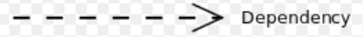
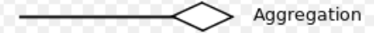
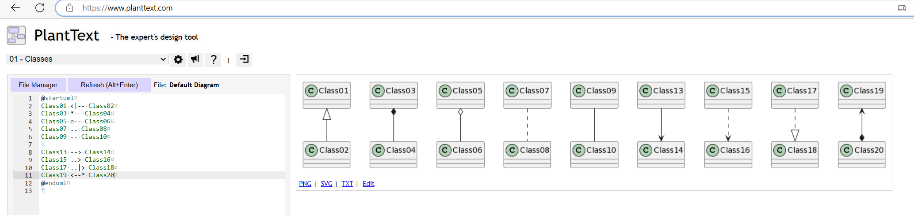

# 类图

## 一、简介
### 1、定义
`Class Diagram`，直译为 类图。用于描述程序中 类、接口 之间的关系。

### 2、关系
#### 2.1、依赖（Dependency）
+ 定义
```text
若在某个类 A 中使用到类 B，且若没有类 B，类 A 编译会报错，则称 A 与 B 之间有依赖关系。
```

+ 表示
```text
虚线普通箭头
```


#### 2.2、继承/泛化（Inheritance/Generalization）
+ 定义
```text
属于依赖关系的一种特例。

如果类 A 继承（extends）了类 B，则称 A 与 B 间存在泛化关系。
```

+ 表示
```text
实线空心三角箭头。
```


#### 2.3、实现（Realization）
+ 定义
```text
属于依赖关系的一种特例。

如果类 A 实现（implements）了类 B，则称 A 与 B 间存在实现关系。
```

+ 表示
```text
虚线空心三角箭头
```


#### 2.4、关联（Association）
+ 定义
```text
属于依赖关系的一种特例。

如果类 A 与类 B 间有联系。比如类 B 作为类 A 的成员变量，则称 A 与 B 间存在关联关系。
```

+ 表示
```text
实线，普通箭头可选。

如果强调方向，则加一个普通箭头。
```


#### 2.5、聚合（Aggregation）
+ 定义
```text
属于关联关系的一种特例。

如果类 A 与类 B 间可以分离且可以独立存在，则称 A 与 B 间存在聚合关系。

比如：人与衣服，可以分离，则为聚合关系。
```

+ 表示
```text
实线空心菱形箭头
```


#### 2.6、组合（Composition）
+ 定义
```text
属于关联关系的一种特例。

如果类 A 与类 B 间不可以分离，则称 A 与 B 间存在组合关系。

比如：人与人头，不可分离，则为组合关系。
```

+ 表示
```text
实线实心菱形箭头
```


## 二、使用 PlantUML 画类图
+ [如何使用 PlantUML 画类图](https://plantuml.com/zh/class-diagram)

#### 1.1、关键词
```text
PlantUML 语法所需的关键词
    @startuml
    abstract        abstract
    abstract class  "abstract class"
    annotation      annotation
    circle          circle
    ()              circle_short_form
    class           class
    diamond         diamond
    <>              diamond_short_form
    entity          entity
    enum            enum
    interface       interface
    protocol        protocol
    struct          struct
    @enduml
```


#### 1.2、元素之间的符号定义
```text
元素之间的关系是用以下符号定义的。
    -- 表示实现
    .. 表示虚线
    <  表示普通箭头
    <| 表示三角箭头
    *  表示实心菱形箭头
    o  表示空心菱形箭头

使用
    关系类型    符号
    泛化/继承   <|--
    实现        <|..	
    组合        *--	
    聚合        o--
    关联        <--
    依赖        <..

举例：
    @startuml
    Class01 <|-- Class02
    Class03 *-- Class04
    Class05 o-- Class06
    Class07 .. Class08
    Class09 -- Class10
    
    Class13 --> Class14
    Class15 ..> Class16
    Class17 ..|> Class18
    Class19 <--* Class20
    @enduml
```


#### 1.3、文字说明
```text
规则
    对于元素，在元素后使用 `"文字"` 来说明
    对于关系，在关系结尾使用 `: 文字` 来说明 。可在 文字前后 添加 < 或 > 表示 哪个对象 作用到 哪个对象上。

举例
    @startuml
    类01 "1" *-- "many" 类02 : 包含
    类03 o-- 类04 : 聚合
    类05 --> "1" 类06
    
    发动机 - 汽车 : 驱动 >
    汽车 *- 轮子 : 拥有 4 >
    汽车 -- 人 : < 所属
    @enduml
```


#### 1.4、方法、属性
```text
规则
    要声明属性和方法，在 元素 后使用符号 `: 字段或方法的名称`。
    可以使用 `{}` 对 方法 或 属性 分组。

举例
    @startuml
    Object <|-- ArrayList
    
    Object : equals()
    ArrayList : Object[] elementData
    ArrayList : size()
    
    class Dummy {
      String data
      void methods()
    }
    
    class Flight {
       flightNumber : Integer
       departureTime : Date
    }
    @enduml
```
